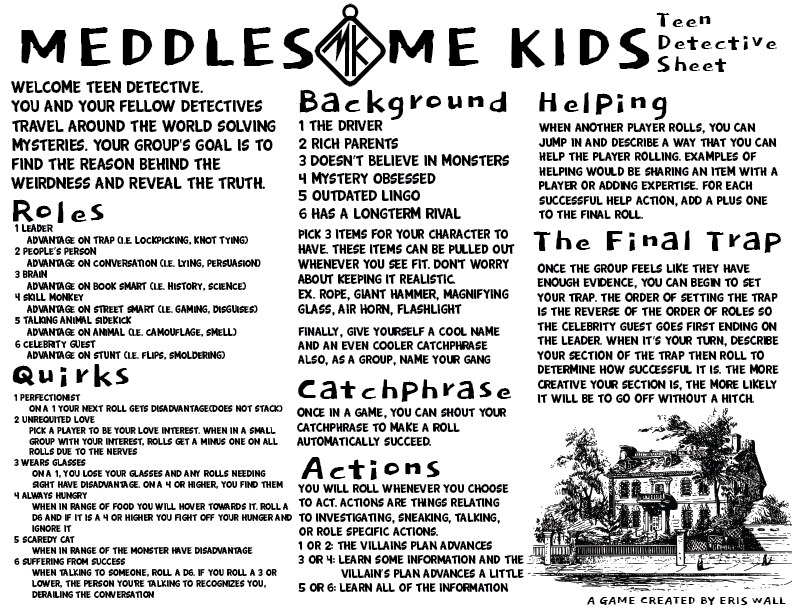
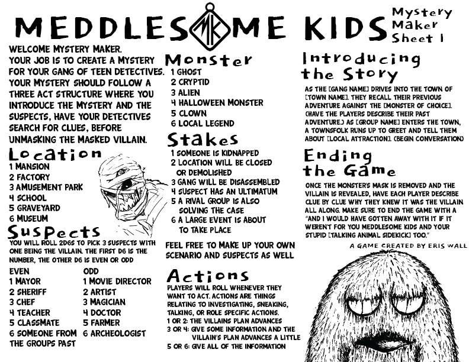
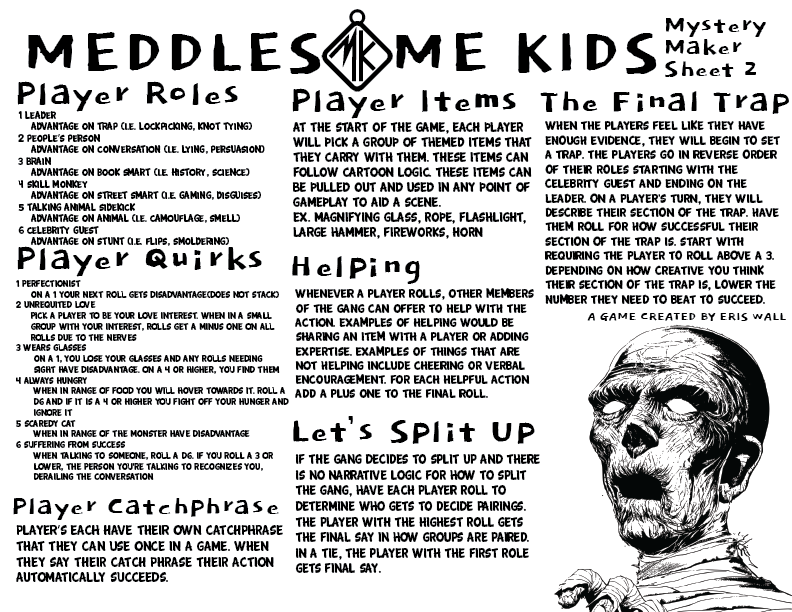

*A one-page tabletop role-playing game inspired by classic mystery cartoons, designed to encourage collaborative storytelling and accessible role-playing.*

---

# Overview

Meddlesome Kids is a one-page tabletop role-playing game inspired by mystery cartoons such as *Scooby-Doo* and minimalist RPGs including *Honey Heist* and *Kaiju Girls*. Players take on the roles of a gang of teenage detectives who travel from town to town solving supernatural mysteries—only to uncover the human culprit hiding behind the monster.

Unlike traditional tabletop RPGs that require lengthy rulebooks, Meddlesome Kids was designed to teach players everything they need to know in just a single page. One player assumes the role of the Mystery Maker, creating suspects, locations, clues, and the hidden villain, while the remaining players work together to investigate the mystery before confronting the culprit in a dramatic final trap.

This project marked my first experience designing a tabletop role-playing game and challenged me to communicate complete game systems as clearly and concisely as possible.

---

# Quick Facts

| | |
|---|---|
| **Status** | 
 Completed 
 |
| **Team Size** | Solo |
| **Duration** | May 2024 - Jun 2024|
| **Project Type** | One-Page Tabletop RPG |
| **Play** | [itch.io](https://maleris.itch.io/meddlesome-kids) |

---

# Design Goals

- Capture the feeling of classic mystery cartoons in a tabletop format.
- Create a complete role-playing experience that fits on a single page.
- Encourage collaborative storytelling between players.
- Reduce rules overhead so new players can begin playing immediately.
- Support replayability through randomized mysteries, locations, and characters.

---

# Core Mechanics

Players create unique teen detectives by selecting a role, background, quirks, and items before setting out to investigate a mystery. As they gather clues, question suspects, and explore dangerous locations, the Mystery Maker advances the villain's plan through dice rolls.

The game culminates in a cooperative final trap, where each player contributes to capturing the disguised villain. The more creative and collaborative the group's plan, the greater their chances of successfully revealing the culprit.

Randomized tables for monsters, suspects, locations, and stakes ensure that each mystery plays differently while remaining easy to prepare.

---

# Gallery

    
    
<em>*The player reference sheet contains everything needed to create a detective, learn the rules, and begin solving mysteries within minutes.*</em>

---

    
    
<em>*The Mystery Maker sheet provides randomized prompts for creating unique mysteries, suspects, monsters, and story hooks while guiding the game's narrative.*</em>

---

    
    
<em>*A companion reference sheet provides Mystery Makers with additional guidance, including player role explanations, optional gameplay systems, and advice for running the game's climactic finale.*</em>

---

# Lessons Learned

Designing Meddlesome Kids taught me that simplicity is often the hardest design challenge. Fitting an entire tabletop role-playing game onto a single page required careful iteration, prioritization, and clear communication. Every mechanic had to justify its inclusion, and every rule had to be concise enough for players to learn quickly without sacrificing meaningful decision making or opportunities for creative storytelling.