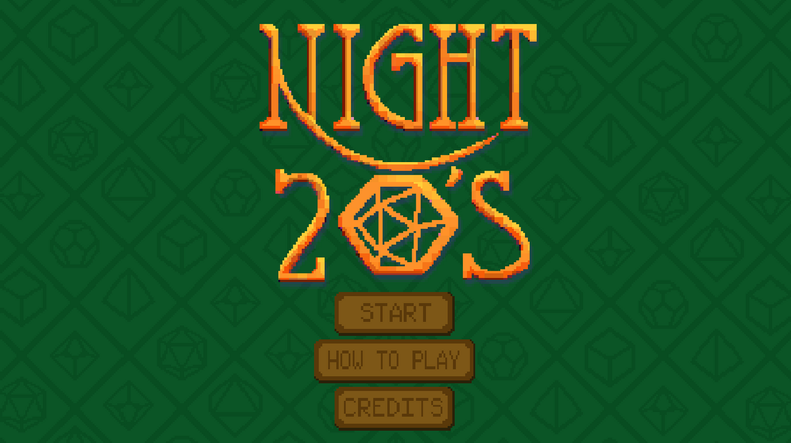
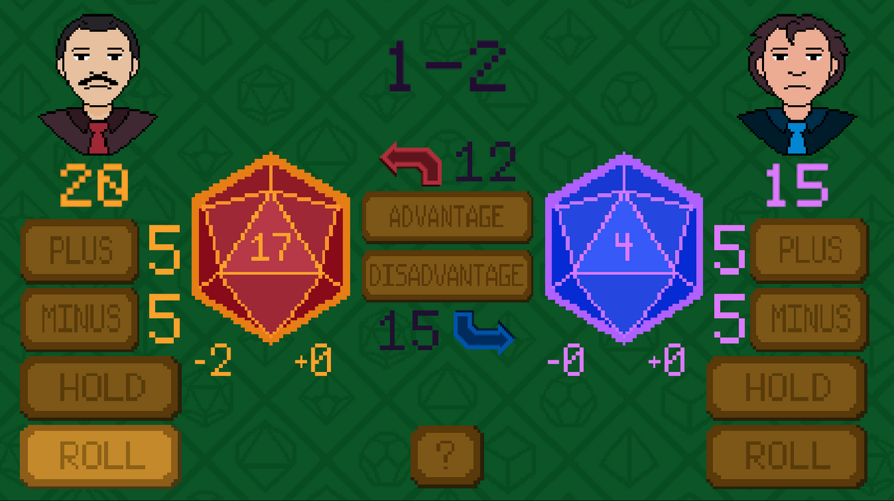
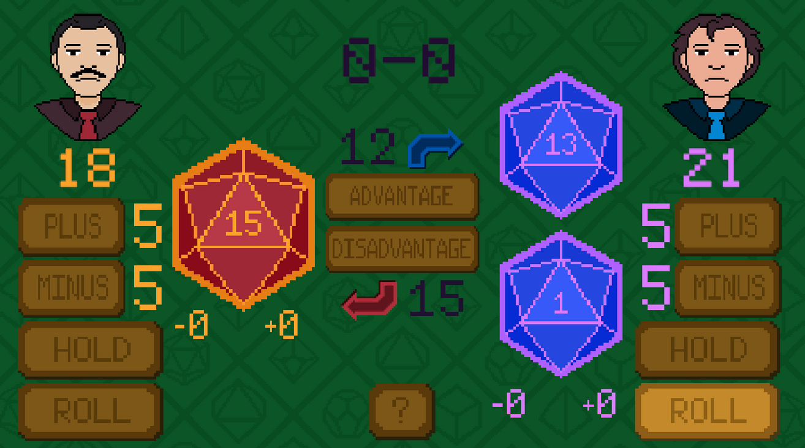
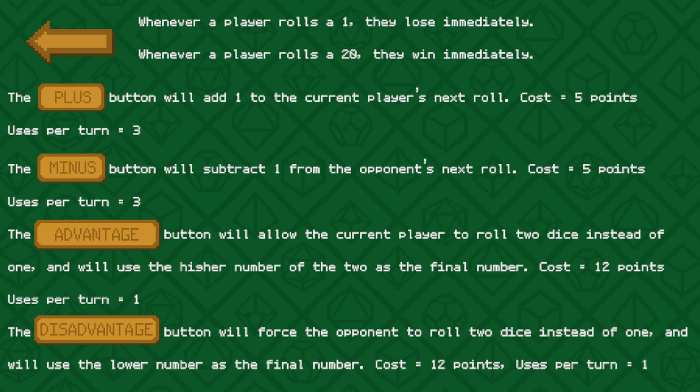

*A competitive two-player game that blends push-your-luck mechanics with strategic resource management, rewarding players who know when to take risks and when to play it safe.*

---

# Overview

Night 20's is a competitive two-player game inspired by push-your-luck games such as *Chicken* and the risk management found in *Blackjack*. Players take turns rolling a twenty-sided die in an attempt to finish with more points than their opponent. However, every additional roll comes with increasing risk—a roll of either **1** or **20** immediately ends the game.

Between rolls, players earn points that can be spent on temporary advantages for themselves or disadvantages for their opponent. Deciding whether to invest points into improving future rolls or continue chasing a higher score creates meaningful strategic decisions throughout every match.

I was responsible for both the game's programming and overall design, focusing on creating a simple ruleset that encouraged tense decision making and frequent player interaction.

---

# Quick Facts

| | |
|---|---|
| **Status** | 
 Completed 
 |
| **Role** | Designer & Programmer |
| **Team Size** | 4 Developers |
| **Duration** | Mar 2024|
| **Project Type** | Competitive Strategy Game |
| **Engine** | Unity |
| **Language** | C# |
| **Platform** | HTML5 |
| **Play** | [itch.io](https://maleris.itch.io/night-20s) |

---

# Design Goals

- Create a simple game centered around meaningful risk-versus-reward decisions.
- Encourage interaction by allowing players to directly influence each other's rolls.
- Reward strategic resource management instead of relying solely on luck.
- Keep matches short while maintaining replayability.

---

# Core Mechanics

Players accumulate points by rolling a twenty-sided die, but every additional roll risks instantly ending the game. Rather than spending points immediately, players must decide whether to save them for future turns or purchase temporary modifiers.

Players can spend points to increase or decrease upcoming rolls, force advantage or disadvantage, or simply hold their current score and challenge their opponent to surpass it. These mechanics create opportunities to bluff, pressure opponents, and weigh short-term gains against long-term strategy.

---

# Gallery

    
    
<em>*The title screen introduces the game's tabletop-inspired presentation and immediately communicates its focus on twenty-sided dice and strategic competition.*</em>

---

    
    
<em>*Players balance their current score against the temptation to roll again while spending points on buffs, debuffs, and dice modifiers to influence the outcome of future turns.*</em>

---

    
    
<em>*Strategic abilities such as Advantage and Disadvantage introduce additional layers of decision making by allowing players to manipulate probability at the cost of valuable points.*</em>

---

    
    
<em>*The in-game rules explain each purchasable ability, allowing players to quickly understand the strategic options available before every match.*</em>

---

# Lessons Learned

Designing Night 20's reinforced how a small set of mechanics can produce surprisingly deep gameplay. By combining a straightforward push-your-luck system with resource management and player interaction, I was able to create meaningful decisions without introducing unnecessary complexity. The project also highlighted the importance of balancing probabilities, pacing, and player agency to ensure that every match remained competitive while still feeling unpredictable.