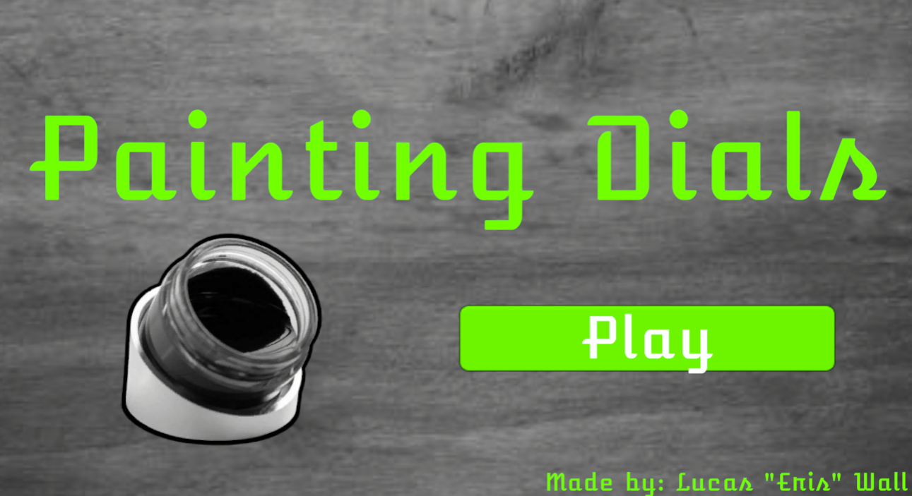
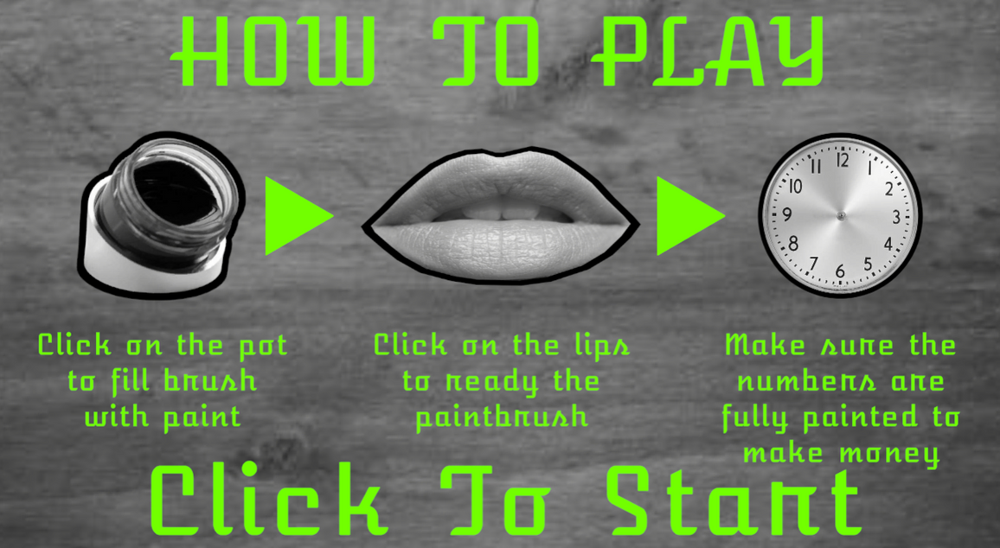
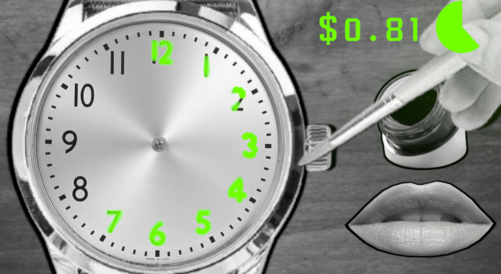
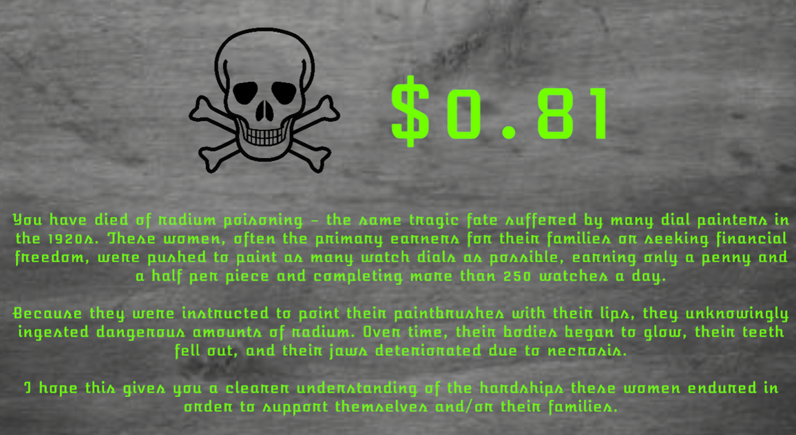

*An educational game that uses interactive gameplay to teach players about the tragic story of the Radium Girls and the dangers they unknowingly faced.*

---

# Overview

Painting Dials is an educational game inspired by the story of the Radium Girls, factory workers who painted glow-in-the-dark watch dials using radium-based paint during the early twentieth century. Players take on the role of one of these workers, repeatedly painting watch numbers while following the same dangerous practices that were expected in the workplace.

The game challenges players to balance speed and accuracy while earning as much money as possible before the effects of prolonged radium exposure become fatal. As the player continues working, visual cues gradually communicate the progression of radiation poisoning, reinforcing the long-term consequences of actions that initially appear harmless.

Rather than simply presenting historical information, the goal was to use gameplay mechanics to create empathy and help players better understand the difficult conditions these workers endured.

---

# Quick Facts

| | |
|---|---|
| **Status** | 
 Completed 
 |
| **Team Size** | Solo |
| **Duration** | Nov 2025 |
| **Project Type** | Educational Game |
| **Engine** | Unity |
| **Language** | C# |
| **Platform** | HTML5 |
| **Play** | [itch.io](https://maleris.itch.io/painting-dials) |

---

# Design Goals

- Teach players about the history of the Radium Girls through interactive gameplay.
- Use gameplay mechanics to reinforce historical events rather than relying solely on written exposition.
- Create empathy by having players experience the repetitive work and difficult choices faced by dial painters.
- Balance educational messaging with an engaging gameplay loop.

---

# Core Gameplay

Players repeatedly dip their brush into radium paint, prepare the brush using the historically accurate lip-pointing technique, and carefully paint watch dials before time runs out. Completing watches earns money, encouraging players to continue working despite the increasing health risks.

As more radium is ingested, visual feedback gradually communicates the effects of radiation poisoning, ultimately leading to the player's death. The ending screen then provides historical context, connecting the player's experience to the real lives of the Radium Girls.

---

# Gallery

    
    
<em>*The title screen introduces the game's minimalist presentation while emphasizing its educational focus and historical subject matter.*</em>

---

    
    
<em>*The tutorial teaches the complete painting process, including the historically accurate practice of pointing brushes with the lips before painting watch dials.*</em>

---

    
    
<em>*Players race against time to complete as many watch faces as possible while unknowingly exposing themselves to increasing amounts of radium in pursuit of higher earnings.*</em>

---

    
    
<em>*After the player's death, the game explains the historical consequences suffered by the Radium Girls, connecting the gameplay experience to the real events that inspired it.*</em>

---

# Lessons Learned

Painting Dials demonstrated how game mechanics can communicate ideas more effectively than exposition alone. Designing the gameplay around repetitive work, financial incentives, and gradual health deterioration helped reinforce the historical narrative through player interaction rather than simply telling the story. The project strengthened my understanding of using mechanics to support educational goals while creating meaningful player experiences.