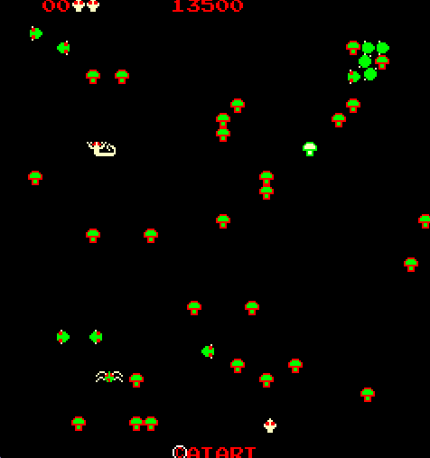

*A recreation of Atari's classic arcade game developed to explore object-oriented design patterns through a complete game implementation.*

---

# Overview

Centipede is a recreation of Atari's classic arcade game developed as an exercise in object-oriented software design. While the gameplay closely follows the original, the primary goal of the project was to gain practical experience implementing software design patterns within a complete game.

By recreating a familiar game, I was able to focus on building clean, maintainable systems rather than designing new gameplay mechanics. Throughout development, I applied multiple design patterns to organize gameplay systems, reduce coupling between objects, and create code that was modular, reusable, and easy to extend.

---

# Quick Facts

| | |
|---|---|
| **Status** | 
 Completed 
 |
| **Team Size** | Solo |
| **Duration** | Sep 2024 - Nov 2024 |
| **Language** | C++ |
| **Platform** | Windows |

---

# Design Patterns

- **Factory Pattern** — Centralized the creation of game objects, simplifying entity spawning and reducing coupling between gameplay systems.
- **Observer Pattern** — Allowed game systems to react to gameplay events without creating direct dependencies between objects.
- **State Machine** — Organized gameplay logic into clearly defined states, simplifying enemy behavior and game flow.
- **Command Pattern** — Encapsulated player actions into reusable command objects, making input handling modular and extensible.
- **Flyweight Pattern** — Reduced memory usage by sharing common data between similar game objects instead of duplicating resources.

---

# Gallery

    
    
<em>*A faithful recreation of Atari's classic Centipede, providing a complete gameplay framework for experimenting with software architecture and object-oriented design.*</em>

---

# Lessons Learned

This project demonstrated the value of software design patterns beyond textbook examples. Implementing Factory, Observer, State Machine, Command, and Flyweight patterns within a complete game provided practical experience applying object-oriented principles to real gameplay systems. It reinforced the importance of designing software that is modular, maintainable, and easy to extend while showing how thoughtful architecture can simplify complex interactions between game objects.