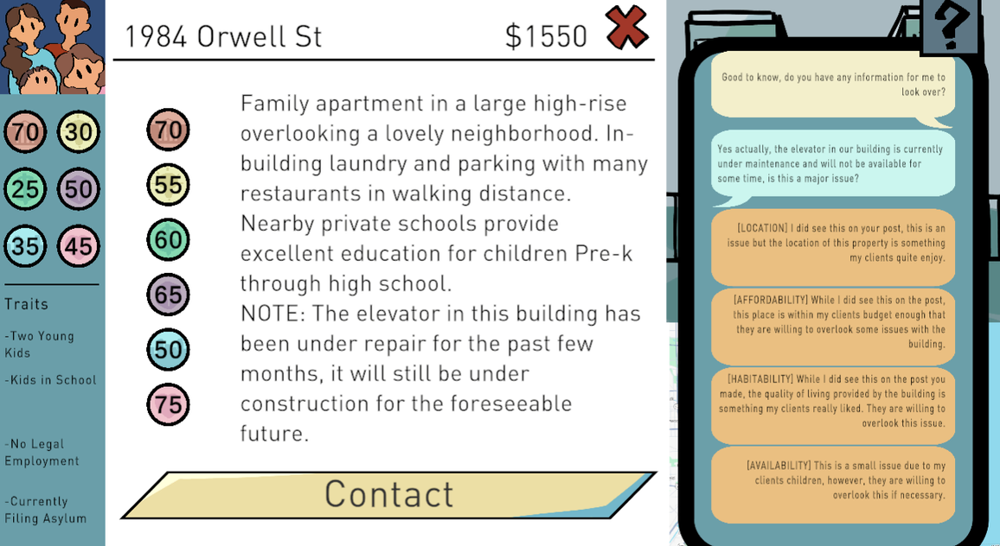
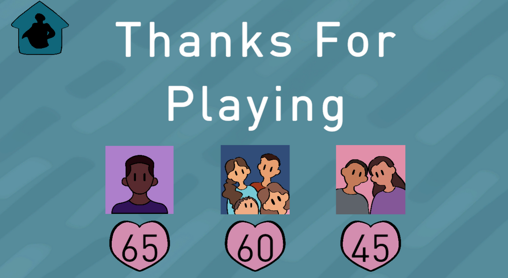

*A simulation game where players help clients find housing by balancing budgets, preferences, and landlord requirements through dialogue and decision making.*

---

# Overview

Housing Hero is a simulation game where players take on the role of a Chicago housing specialist responsible for matching clients with apartments that best fit their needs. Every client has unique preferences and circumstances, requiring players to weigh affordability, location, amenities, and personal requirements before recommending a property.

Once a suitable apartment has been selected, players must communicate with landlords to address any concerns and negotiate on behalf of their clients. Successfully balancing both the client's needs and the landlord's requirements is key to securing housing.

My primary contribution focused on gameplay programming and user interface systems. The feature I was most proud of was the dynamic texting conversation system. Messages are created and removed as they scroll on and off screen while automatically repositioning the remaining conversation, allowing long discussions to remain efficient without sacrificing a natural messaging interface.

---

# Quick Facts

| | |
|---|---|
| **Status** | 
 Completed 
 |
| **Role** | Gameplay Programmer |
| **Team Size** | 4 Developers |
| **Duration** | Nov 2025 |
| **Engine** | Unity |
| **Language** | C# |
| **Platform** | HTML5 |
| **Play** | [itch.io](https://maleris.itch.io/housing-hero) |

---

# Technical Highlights

- Dynamic scrolling conversation system
- Automatic loading and unloading of chat messages
- Responsive message alignment and layout
- Data-driven client and apartment information
- Decision-based gameplay and dialogue

---

# Gallery

    
    
<em>*Players compare multiple housing options by balancing apartment features, pricing, and client preferences before recommending the best fit.*</em>

---

    
    
<em>*After selecting a property, players communicate with landlords through a dynamic messaging system that automatically loads, unloads, and repositions messages as conversations grow.*</em>

---

    
    
<em>*Each completed playthrough summarizes how successfully players matched clients with housing, encouraging thoughtful decision making throughout the game.*</em>

---

# Lessons Learned

Housing Hero gave me valuable experience building user interface systems that manage large amounts of dynamic content. Designing the scrolling conversation window reinforced the importance of separating presentation from data, allowing messages to be created, removed, and repositioned efficiently as conversations changed. It also highlighted how thoughtful UI design can make complex gameplay systems feel intuitive and approachable for players.