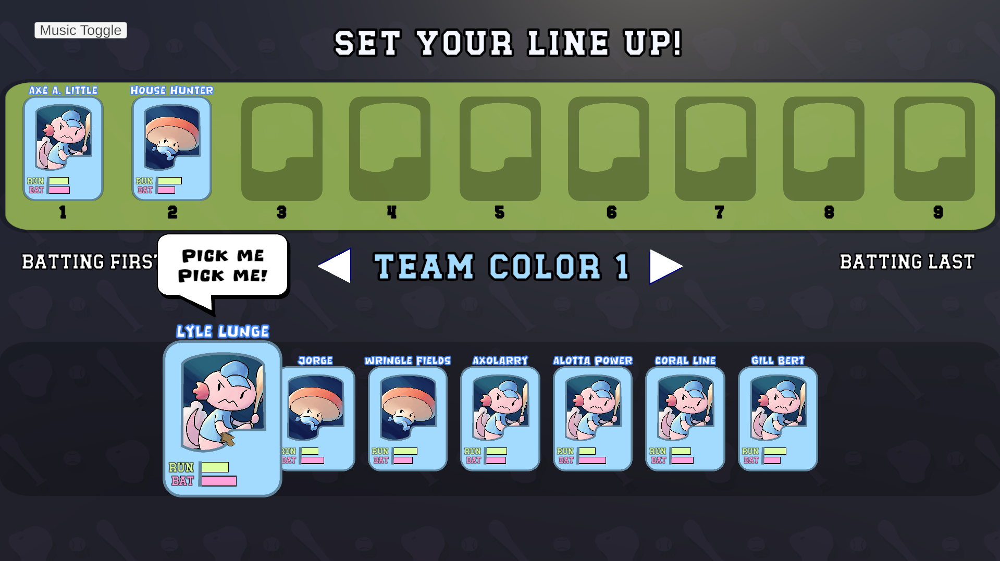
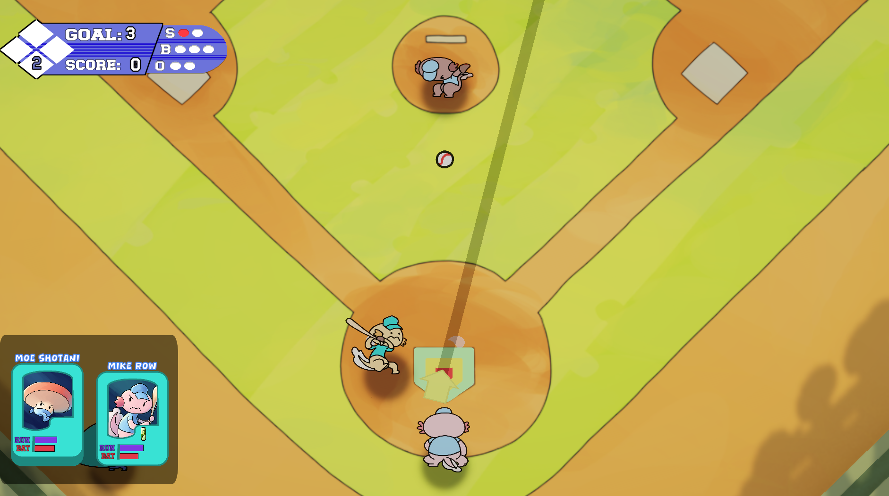
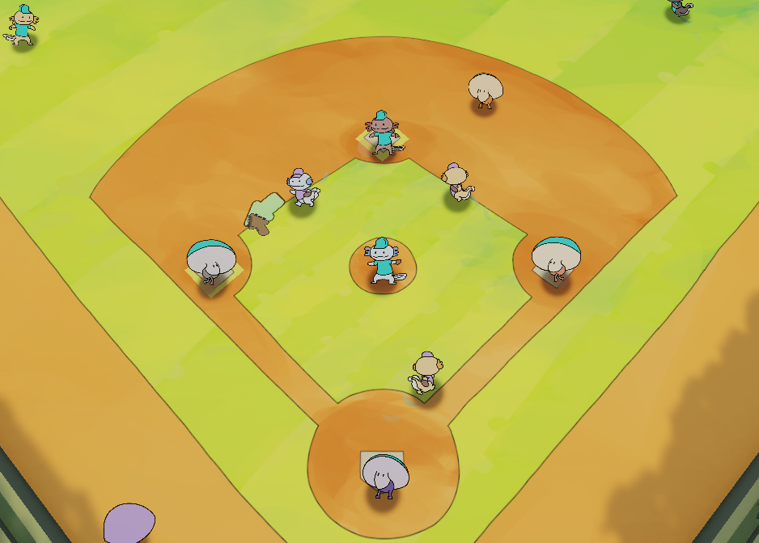
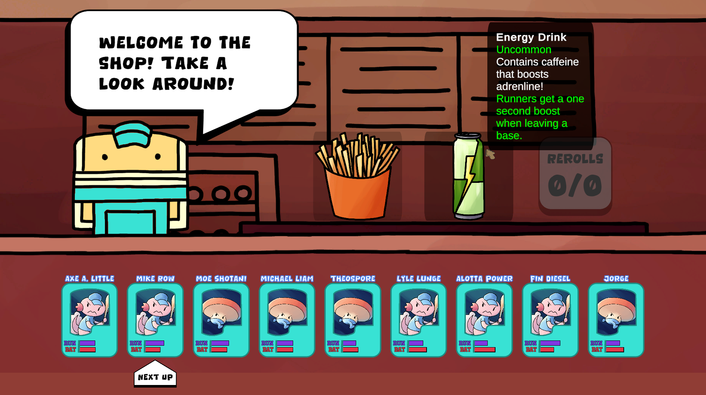
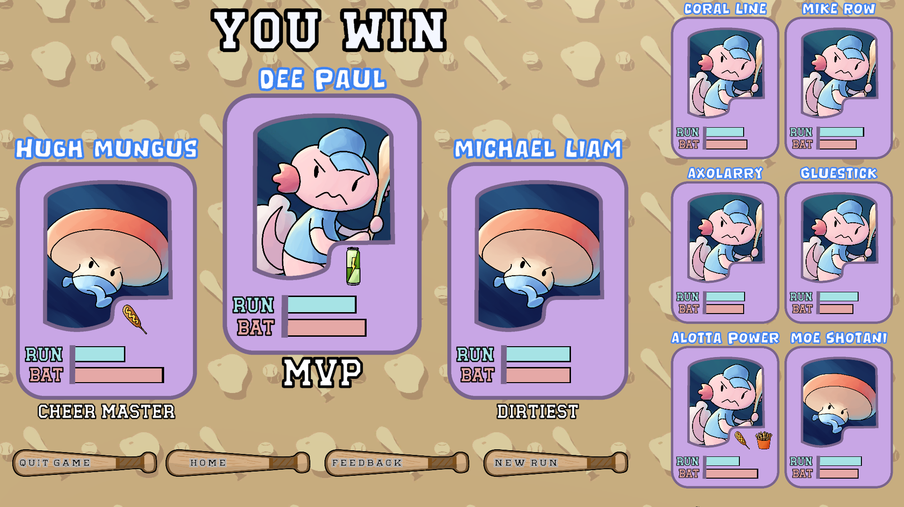

*A baseball roguelike built around modular gameplay systems, strategic team management, and data-driven content designed for rapid iteration and future expansion.*

---

<h1 class="section-title">Project Overview</h1>

Monster League Baseball is an actively developed 2.5D baseball roguelike that blends strategic team management with fast-paced arcade baseball gameplay. As the project's Lead Designer and Gameplay Programmer, I established the game's overall vision, designed its core mechanics, and continue to guide its development from concept to implementation.

Beyond defining the player experience, I develop the underlying gameplay systems and software architecture that support the game's continued growth. My focus is on creating modular, maintainable, and data-driven systems that enable rapid iteration, simplify the addition of new content, and allow designers to expand gameplay without requiring significant code changes.

Working closely with artists, designers, and fellow programmers, I help translate creative ideas into polished gameplay while balancing technical scalability with an engaging player experience.

---

<h1 class="section-title">Quick Facts</h1>

| | |
|---|---|
| **Status** | 
  Active Development 
 |
| **Role** | Lead Designer & Gameplay Programmer |
| **Team Size** | 8 Developers |
| **Duration** | May 2025 - Present |
| **Engine** | Unity |
| **Language** | C# |
| **Version Control** | Perforce |
| **Platform** | Windows & Mac |
| **Play** | [itch.io](https://jfraider.itch.io/monster-league-baseball) |
| **Videos** | [YouTube Devlog](https://www.youtube.com/@LungeSoftware) |

---



---

## Lead Design

Directed the creative vision of Monster League Baseball, establishing the core gameplay experience while guiding the design of new mechanics throughout development.

▶ [Core Gameplay Vision](#core-gameplay-vision)

---

## Gameplay Programming

Implemented the core gameplay systems that define the player's on-field experience.

▶ [Batting System](#batting-system)

▶ [Running System](#running-system)

▶ [Upgrade System](#upgrade-system)

▶ [Superlative System](#superlative-system)

---

## Challenges & Lessons Learned

Reflecting on the technical and design challenges encountered throughout development, the decisions made to overcome them, and the insights gained that continue to influence my approach to gameplay programming and software engineering.

▶ [Challenges and Lessons](#challenges-lessons)

---

<h1 class="section-title">Lead Design</h1>

## Core Gameplay Vision

Monster League Baseball was created to address a gap in the sports game genre by combining the strategic depth and replayability of roguelikes with the accessibility and excitement of baseball. Inspired by games such as *Slay the Spire*, *Dicey Dungeons*, and *Vampire Survivors*, my goal was to create a sports game where every run feels unique while remaining approachable to players of all skill levels.

From the beginning of development, every design decision has been guided by four core design pillars that continue to shape the game today.

---

# Accessibility First

One of the primary design goals was creating a game with a **low skill floor and a high skill ceiling**. Players should be able to jump into a game with only a basic understanding of baseball concepts such as strikes, outs, and innings, without requiring lengthy tutorials or prior experience.

At the same time, experienced players are rewarded through strategic team building, upgrade synergies, and mastery of the game's mechanics. My goal was to create a game that players could immediately understand while continuing to discover new strategies over dozens of playthroughs.

---

# Every Run Is Unique

A central pillar of Monster League Baseball is giving players ownership over the team they build.

Before every run, players draft nine athletes from a roster of twelve, allowing them to create teams that reflect their preferred playstyle. Throughout development, one of the most rewarding experiences has been watching players naturally develop favorite characters, preferred team compositions, and even players they intentionally avoid.

This philosophy extends beyond gameplay. Players can customize their team's colors, while the post-game Superlative System celebrates individual player achievements, helping each team feel unique and memorable.

    
    
<em>Lineup screen where players draft their team before beginning a run.</em>

---

# Meaningful Decisions

Every inning is designed to present meaningful choices that influence the remainder of the run.

Players continuously decide how to improve their team through upgrade selection, roster management, and long-term planning. Rather than relying solely on mechanical skill, Monster League Baseball encourages experimentation and rewards discovering powerful synergies between players and upgrades.

The objective is for every run to tell a different story, giving players new strategies to explore and reasons to return.

---

# Celebrating Baseball

While Monster League Baseball embraces the creativity and replayability of the roguelike genre, it is also intended to celebrate the personality and traditions of baseball.

Many gameplay elements draw inspiration from classic ballpark culture. Upgrade items are themed around stadium food such as hot dogs, popcorn, burgers, peanuts, and slushies, while occasionally embracing more unconventional additions like lobster, shish kebabs, and cans of worms to reinforce the game's playful tone.

The same philosophy extends to the game's presentation. An early trailer featured a remix of *Take Me Out to the Ball Game*, while boss teams such as the **Cy Youngs** reference baseball history and terminology. These details help create a lighthearted atmosphere that captures the charm of spending a day at the ballpark while embracing the game's whimsical world.

---

<h1 class="section-title">Gameplay Programming</h1>

## Batting System

### Highlights

- ⚾ Timing-based batting mechanic combining swing timing, directional aiming, and power control.
- 📐 Custom algorithms calculate launch angle and hit distance based on player input and pitch location.
- 🎲 Controlled randomness creates varied yet predictable batting outcomes.
- 🔄 Finite State Machine architecture simplifies gameplay flow and future feature additions.
- 🧩 Modular implementation supports extensibility for abilities, animation events, and gameplay modifiers.

The batting system is built around a timing-based minigame that combines player timing, directional aiming, and power control into a single interaction. As a pitch approaches the batter, the player must swing at the correct moment while clicking and dragging the mouse to determine both the direction and power of the hit. The timing of the swing, combined with the player's input and the pitch location, determines the resulting trajectory of the ball.

To calculate the final hit, the system uses two custom algorithms that determine the launch angle and travel distance. These calculations combine the ball's position within the strike zone, player-controlled power and aim, and a controlled amount of randomness to produce varied yet predictable outcomes. This approach rewards player skill while introducing enough controlled randomness to keep batting outcomes varied and prevent gameplay from feeling deterministic.

Internally, the batting mechanic is implemented as a finite state machine consisting of several gameplay states, including **Waiting for Input**, **Swing Back**, **Swing Forward**, and **Idle**. Separating the mechanic into distinct states keeps the implementation modular and easier to maintain, while also simplifying the addition of future features such as batting abilities, animation events, or timing modifiers.

This architecture allowed the batting system to remain easy to extend throughout development while keeping gameplay logic isolated and readable.

    
    
<em>Players combine timing, directional aiming, and power control to influence the trajectory of every hit.</em>

---

## Running System

### Highlights

- 🏃 Direct mouse-controlled baserunning with forward and retreat movement.
- ⚾ Automatic enforcement of baseball base occupancy and force-play rules.
- 🔄 Conflict resolution system prevents multiple runners from occupying the same base.
- 👥 Supports both individual runner control and advancing all eligible baserunners.
- 🧩 Modular architecture designed to support future mechanics such as stamina and advanced baserunning abilities.

The running system provides players with direct control over baserunners through mouse input, allowing them to advance toward the next base or retreat to a previous base at any point during play. The system is designed to give players precise control while automatically enforcing the rules and constraints of baseball.

A key challenge was managing base occupancy. To ensure only one runner occupies a base at a time, the system models baseball's base occupancy and force-play rules, automatically resolving runner conflicts while ensuring every baserunning decision results in a valid game state. If a player attempts to advance to an occupied base, the runner is redirected to prevent multiple players from stacking on the same base. Conversely, when a force play requires a trailing runner to advance, the occupying runner is automatically moved forward to maintain correct baseball behavior.

The running system supports both individual runner movement and advancing all eligible baserunners simultaneously, allowing gameplay logic to respond appropriately to different game situations without duplicating code. By separating these behaviors into reusable systems, additional running mechanics can be introduced without significantly modifying the existing implementation.

A planned enhancement is a stamina system that limits how long runners can remain between bases. This will discourage players from indefinitely stalling between bases while introducing an additional layer of strategic decision-making during play.

    
    
<em>Players can direct individual baserunners at any time while the running system automatically enforces baseball rules such as force plays and base occupancy.</em>

---

## Upgrade System

### Highlights

- 🍔 Data-driven item framework using configurable JSON definitions.
- ⭐ Weighted rarity system with support for unique team-wide items.
- 🔀 Item merging mechanic that combines compatible upgrades while conserving inventory space.
- 📡 Event-driven ability system using tagged gameplay events and effect dispatching.
- 🧩 Modular architecture that allows new upgrades to be added with minimal changes to existing systems.

The upgrade system provides players with meaningful progression between innings through a drag-and-drop interface. After each inning, players are presented with a randomized selection of upgrades that can be applied to individual team members. Players select from a variety of food items that provide permanent stat increases, modify gameplay mechanics such as batting zones, or grant conditional abilities that activate during gameplay.

Upgrade selection is driven by a data-driven item framework. Each item contains configurable properties such as rarity, activation conditions, and unique restrictions. When generating upgrade choices, the system performs weighted rarity selection while ensuring that unique items can only exist once per team. This approach makes it easy to introduce new upgrades or rebalance existing ones without modifying gameplay logic.

To encourage long-term progression, compatible upgrades can be merged together. Merging combines two related items into a more powerful version while freeing an inventory slot, creating meaningful decisions between expanding a player's inventory or strengthening existing abilities.

During gameplay, upgrades are activated through an event-driven system. Gameplay systems broadcast tagged events whenever significant actions occur, such as batting, pitching, or baserunning. The Upgrade Manager listens for these events, identifies any matching upgrades on the relevant player or across the entire team, and dispatches the appropriate effect through a lookup map. By separating event detection from effect execution, new upgrades can be added by defining their data and implementing their behavior without requiring changes to the core gameplay systems.

This architecture keeps the upgrade framework modular, extensible, and easy to maintain while supporting a growing library of unique player abilities.

    
    
<em>Between innings, players strengthen their team by selecting upgrades that provide permanent stat increases, gameplay modifications, or unique conditional abilities.</em>

---

## Superlative System

### Highlights

- 📊 Tracks player performance statistics throughout gameplay.
- 🏆 Generates personalized end-of-game awards based on recorded statistics.
- 🔄 Prevents duplicate award recipients by dynamically selecting alternative superlatives.
- 🎲 Includes randomized fallback awards to handle edge cases and guarantee results.
- 🧩 Modular architecture allows new statistics and awards to be added independently.

The superlative system generates personalized post-game awards that highlight memorable player performances at the conclusion of each match. Throughout gameplay, the system continuously records a wide range of player statistics, including runs scored, upgrades collected, outs recorded, and even more lighthearted metrics such as the number of particles spawned. These statistics are then evaluated to determine which players best fit each available award category.

To ensure each award remains meaningful, the system prevents duplicate recipients whenever possible. Once a player has been selected for a superlative, that award category is removed from the remaining selection pool, and the system searches for alternative candidates for subsequent awards. This produces a more varied and engaging end-of-game summary while ensuring multiple players can be recognized for different contributions.

The system also includes several fallback mechanisms to guarantee that post-game awards can always be generated. In situations where gameplay statistics do not produce enough unique results, the remaining awards are selected from a pool of randomized superlatives that do not depend on tracked game data. This prevents edge cases from causing duplicate awards or interrupting the end-of-game sequence.

By separating statistic collection from award selection, the superlative system is easily extensible. New statistics and award categories can be introduced independently, allowing additional superlatives to be added without modifying the core evaluation logic.

    
    
<em>At the conclusion of each match, the Superlative System recognizes memorable player performances by generating personalized post-game awards based on tracked gameplay statistics.</em>

---

<h1 class="section-title">Challenges & Lessons Learned</h1>

Developing Monster League Baseball has taught me as much about game design and software engineering as it has about programming. Throughout the project, I encountered challenges that fundamentally changed how I approach design, planning, and long-term development.

---

# Designing for Player Understanding

One of the earliest challenges was realizing that players often struggled to understand the game without direct guidance. During early playtests, I regularly found myself explaining mechanics or coaching players through the first inning. One memorable playtester spent nearly thirty minutes attempting to complete the opening inning without success because the game's mechanics were not communicated clearly enough.

Watching players become confused instead of engaged reinforced one of the most valuable lessons I have learned as a designer: **if players need an explanation, the game is not communicating effectively.** Since then, I have continually refined mechanics, visual feedback, and user interactions to make the game understandable at a glance while preserving its strategic depth.

---

# The Value of Planning

Before beginning this project, I disliked creating game design documents and often viewed them as unnecessary overhead. Early development reflected that mindset. The project became increasingly directionless, features expanded beyond the team's capacity, and we ultimately missed a major development milestone after spending months without a clear roadmap.

That experience completely changed my perspective. Today, I rely on detailed design documentation to establish the game's vision, prioritize development, and communicate ideas with the rest of the team. Having a shared design document has made development significantly more focused while reducing scope creep and uncertainty.

---

# Designing for Change

Working on a long-term project has taught me that both code and game design inevitably evolve. Decisions that seemed reasonable early in development often became limitations months later as the project grew and new features were introduced.

This experience has encouraged me to write more modular, maintainable systems that are easier to extend without disrupting existing gameplay. It has also changed how I approach design decisions. Rather than becoming attached to individual mechanics, I now evaluate every feature based on whether it improves the overall player experience.

The batting system is a good example of this mindset. While its core design has remained largely unchanged for many months, continued playtesting has highlighted opportunities to improve readability and player feedback. Although redesigning an established feature can be difficult, I have learned that letting go of existing work in pursuit of a better experience ultimately results in a stronger game.

---

# Technologies Used

- Unity
- C#
- JSON
- Perforce
- Shader Graph
- Visual Studio
- GIMP

---

# Looking Ahead

Monster League Baseball continues to evolve through regular iteration and playtesting. As development progresses, I plan to further expand the game's systems while refining the overall experience.

Current goals include:

- **4 Unique Playable Characters**, each with distinct abilities and playstyles.
- **9 Boss Encounters** featuring unique mechanics and strategic challenges.
- **50 Upgrade Items** to support a wide variety of player builds.
- **20 Upgrade Mergers** that reward experimentation and long-term progression.
- **Seeded Runs** for replaying, sharing, and competing with identical game seeds.
- **An In-Game Almanac** documenting lore, player abilities, upgrades, and gameplay mechanics.