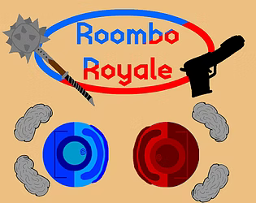
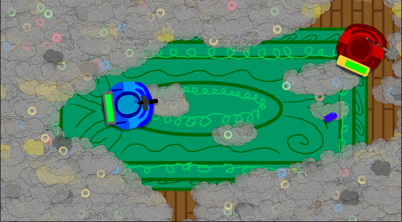
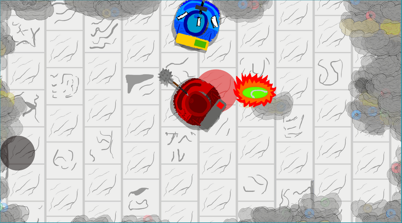
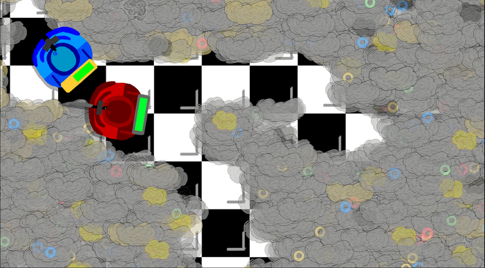

*A local multiplayer arena game where weapon variety and customizable match rules create fast-paced and unpredictable Roomba battles.*

---

# Overview

Roombo Royale is a local multiplayer arena game developed as part of a team project. Players control weaponized Roombas and compete using three unique weapons: a knife for high-damage close combat, a mace for sweeping area attacks, and a gun for ranged engagements. Each weapon encourages a different playstyle, allowing players to adapt their strategy throughout a match.

My primary role on the project was gameplay programming and user interface development. The feature I was most proud of was the customizable match settings system, which allowed players to modify gameplay rules before each match. By exposing settings such as movement speed, damage, and health, players could create unique game modes ranging from fast-paced **Hyper Speed** matches to tense **Sudden Death** battles.

In addition to gameplay customization, I implemented several user interface elements, including dynamic battery health bars that transition from green to yellow, red, and finally black as players lose health, providing immediate visual feedback during combat.

---

# Quick Facts

| | |
|---|---|
| **Status** | 
 Completed 
 |
| **Role** | Gameplay Programmer |
| **Team Size** | 5 Developers |
| **Duration** | April 2025 - Jun 2025 |
| **Engine** | Unity |
| **Language** | C# |
| **Platform** | HTML5 |
| **Play** | [itch.io](https://maleris.itch.io/roombo-royale) |

---

# Programming Contributions

- Three distinct weapon systems with unique gameplay roles
- Fully customizable match settings
- Dynamic battery health UI
- Modular gameplay parameters supporting custom game modes
- Local multiplayer gameplay

---

# Gallery

    
    
<em>*Roombo Royale's title screen introduces the game's lighthearted, competitive atmosphere while establishing its visual identity.*</em>

---

    
    
<em>*Players battle using three distinct weapon types; a knife for close-range damage, a mace for sweeping attacks, and a gun for ranged combat—each encouraging different playstyles and strategies.*</em>

---

    
    
<em>*Multiple arena layouts create different combat scenarios and encourage players to continually adapt their positioning and tactics throughout each match.*</em>

---

    
    
<em>*Fast-paced close-quarters encounters highlight the dynamic battery health system, providing players with immediate visual feedback as damage is taken during combat.*</em>

---

# Lessons Learned

Working on a team project reinforced the importance of building gameplay systems that are both modular and configurable. Creating a flexible match settings system demonstrated how exposing gameplay variables can dramatically increase replayability without requiring additional game mechanics. It also provided valuable experience collaborating with designers and artists while developing features that integrated cleanly into the rest of the game.