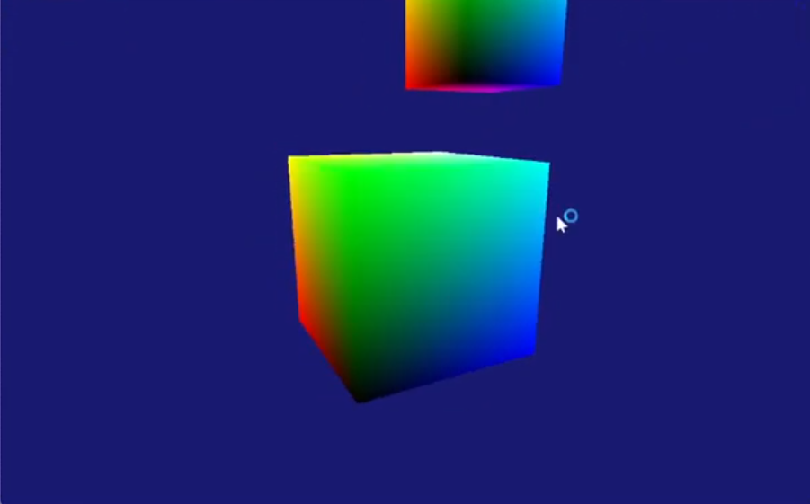
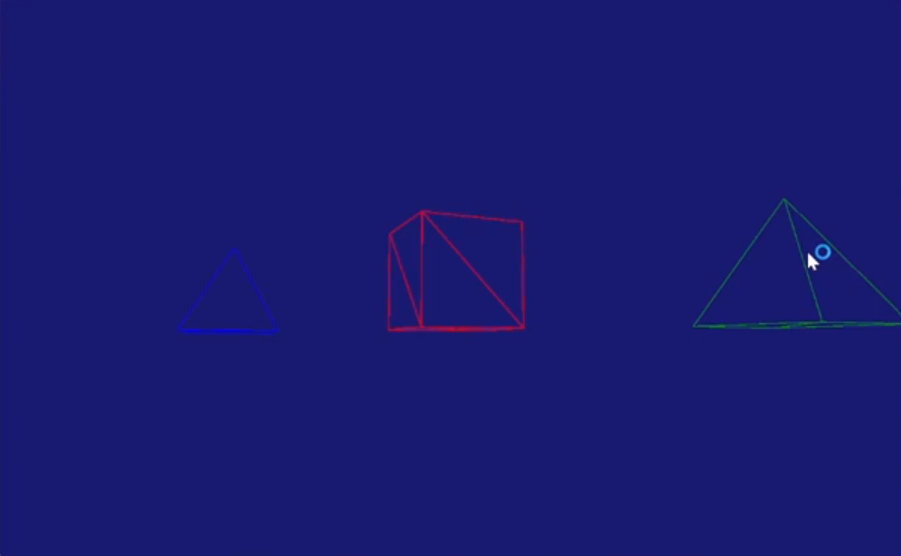
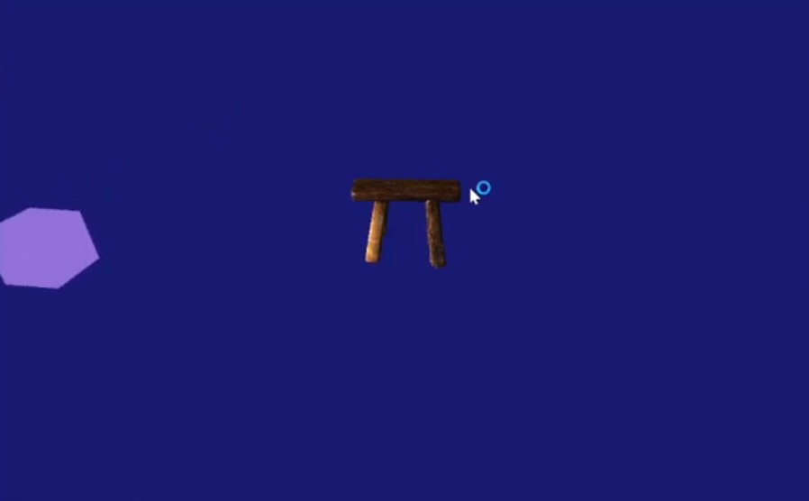
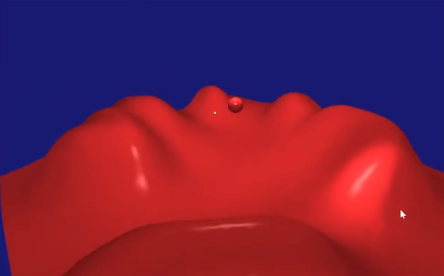
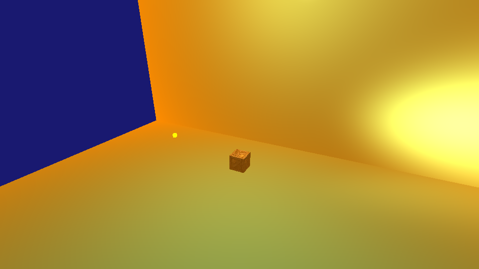
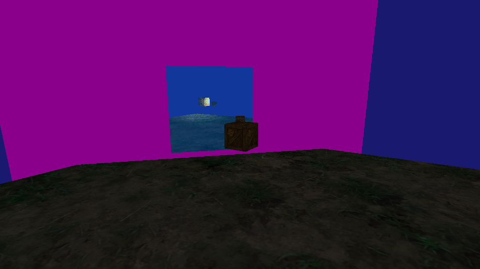

*Custom DirectX 11 graphics engine featuring reusable rendering systems, custom HLSL shaders, terrain generation, and real-time rendering techniques.*

---

# Overview

The Graphics Engine is a custom DirectX 11 rendering framework developed to explore modern graphics programming and gain hands-on experience with the real-time rendering pipeline. The project focused on building reusable rendering systems while implementing the graphics techniques required to display and render interactive 3D scenes.

At the core of the engine is a flexible Graphics Object framework paired with a collection of custom HLSL vertex and pixel shaders. Together these systems support colored, textured, and illuminated rendering while allowing different rendering techniques to share a common architecture.

To further explore graphics programming, the engine also implements terrain generation from height maps, dynamic lighting, fog, mirrors, and a collection of reusable primitive meshes including cubes, spheres, pyramids, planes, and skyboxes.

---

<h1 class="section-title">Quick Facts</h1>

| | |
|---|---|
| **Status** | 
  Completed 
 |
| **Team Size** | Solo |
| **Duration** | Jan 2025 - April 2025 |
| **Language** | C++ & HLSL|
| **Version Control** | Perforce |
| **Platform** | Windows |

---

## Technical Highlights

Implemented a reusable graphics framework capable of rendering interactive 3D scenes while exploring the major stages of the DirectX 11 rendering pipeline.

▶ [Graphics Object Framework](#graphics-object-framework)

▶ [Shader Programming](#shader-programming)

▶ [Terrain Rendering](#terrain-rendering)

▶ [Rendering Effects](#rendering-effects)

▶ [Challenges & Lessons](#challenges-lessons)

---

<h1 class="section-title">Graphics Object Framework</h1>

### Highlights

- Reusable rendering architecture
- Graphics object abstraction
- Model and texture management
- Primitive mesh library

The Graphics Object framework separates rendering behavior from scene objects by encapsulating shaders, textures, lighting information, and rendering state within reusable graphics objects. This allows different rendering techniques to share a common interface while minimizing duplicated rendering code.

To support rapid scene creation, the engine includes several built-in primitive meshes including cubes, spheres, pyramids, planes, skyboxes, and terrain generated from height maps. Each mesh contains vertex positions, normals, and UV coordinates, allowing them to immediately support textured and lit rendering.

    
    
<em>*Colored cube rendered using a custom HLSL shader. This early rendering test verified vertex transformations, color interpolation, and the DirectX 11 rendering pipeline.*</em>

    
    
<em>*Built-in primitive meshes rendered in wireframe mode. The engine includes reusable geometric models that support textured and lit rendering through a shared graphics framework.*</em>

    
    
<em>*Procedurally generated sphere demonstrating the engine's ability to construct and render geometry through generated vertex and index data.*</em>

---

<h1 class="section-title">Shader Programming</h1>

### Highlights

- Custom HLSL vertex shaders
- Custom HLSL pixel shaders
- Constant buffer management
- Lighting calculations

A major focus of the project was writing custom HLSL shaders to better understand the GPU rendering pipeline. Vertex shaders transform model geometry into screen space while pixel shaders perform texture sampling and lighting calculations to produce the final image.

Shader parameters including transformation matrices, camera information, lighting data, and material properties are passed through DirectX constant buffers each frame, allowing rendering behavior to be dynamically updated during runtime.

Developing these shaders provided valuable experience with how CPU-side rendering code communicates with GPU programs to render interactive 3D scenes.

    
    
<em>*Scene illuminated using custom HLSL lighting shaders, showcasing dynamic light sources and material-based shading.*</em>

---

<h1 class="section-title">Terrain Rendering</h1>

### Highlights

- Height map terrain generation
- Texture mapping
- Lighting support

The terrain renderer generates geometry directly from grayscale height maps, allowing landscapes to be created procedurally while integrating seamlessly into the engine's lighting and rendering systems.

Because terrain is treated as another graphics object, it automatically benefits from existing rendering features including textures, lighting, and camera movement.

    
    
<em>*Height map–generated terrain rendered with custom shaders and integrated into the engine's rendering pipeline.*</em>

---

<h1 class="section-title">Rendering Effects</h1>

### Highlights

- Dynamic lighting
- Fog
- Mirror rendering
- Texture mapping

To explore common graphics techniques, the engine implements several real-time rendering effects including dynamic lighting, textured rendering, atmospheric fog, and mirrors. These effects were integrated into the existing rendering architecture rather than implemented as isolated demonstrations, making them reusable across multiple scenes and graphics objects.

    
    
<em>*Atmospheric fog implemented within the pixel shader, allowing distant geometry to gradually blend into the scene and improve depth perception.*</em>

    
    
<em>*Mirror rendering achieved through an additional rendering pass, allowing reflective surfaces to display real-time scene reflections.*</em>

---

<h1 class="section-title">Challenges & Lessons</h1>

The Graphics Engine was my first deep exploration into modern graphics programming and the DirectX 11 rendering pipeline. Implementing my own HLSL shaders provided a much stronger understanding of how data moves from CPU-side game objects into GPU programs before finally being transformed into rendered pixels.

One of the biggest lessons from the project was the importance of abstraction. Separating graphics objects, models, shaders, and rendering state into reusable systems made it significantly easier to introduce new rendering techniques without rewriting existing code.