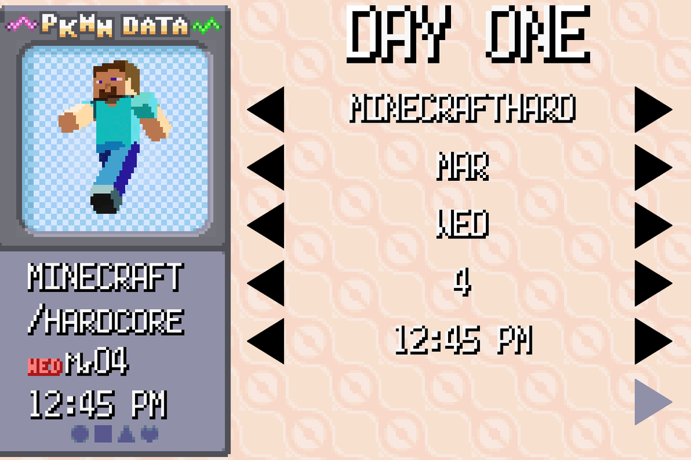
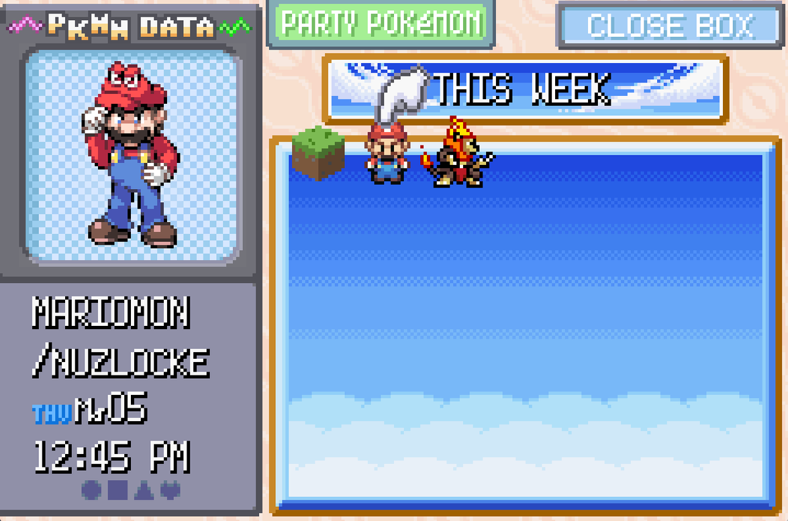
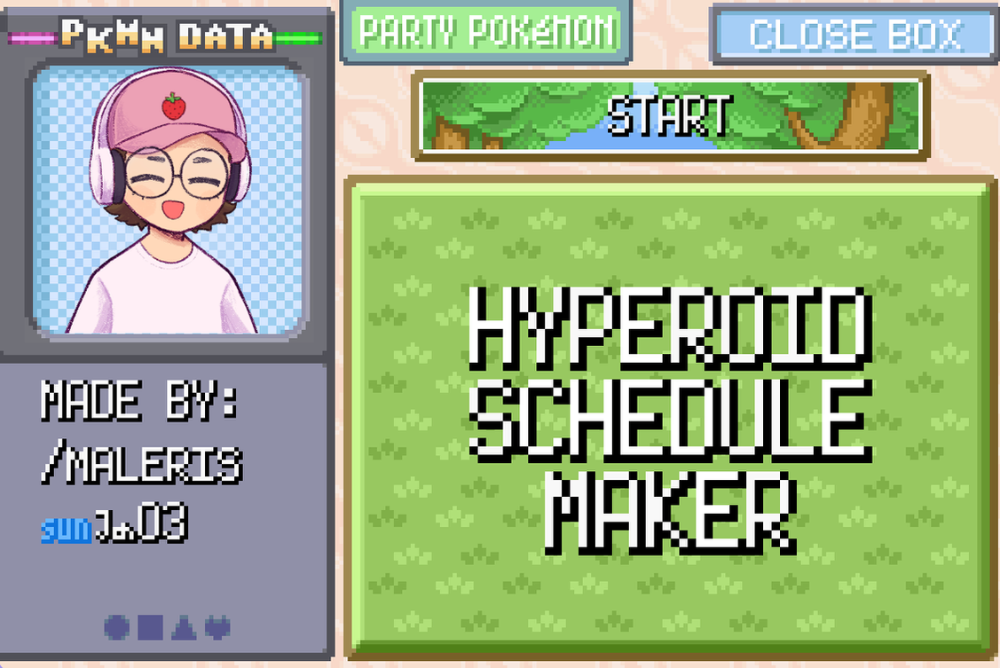

*A custom desktop application inspired by the Pokémon Emerald PC interface, designed to simplify weekly Twitch schedule creation through reusable templates and automated date management.*

---

# Overview

The Hyperoid Schedule Maker is a desktop utility I created for a friend to simplify the process of producing weekly Twitch schedules. Instead of manually editing images every week, the application provides a familiar interface modeled after the Pokémon Emerald PC storage system, allowing schedule information to be updated quickly while maintaining a consistent visual style.

The application automates repetitive tasks such as updating dates, scrolling through available options, and previewing schedule changes in real time. By reducing the amount of manual editing required, new schedules can be created much faster while remaining visually consistent.

Although designed for a specific use case, the project demonstrates how software can automate repetitive workflows through a clean, user-friendly interface. Future improvements are planned to further simplify adding new artwork and schedule templates without requiring modifications to the application.

---

# Quick Facts

| | |
|---|---|
| **Status** | 
 Archived 
 |
| **Team Size** | Solo |
| **Language** | C# |
| **Platform** | Windows |
| **Project Type** | Productivity Tool |

---

# Technical Highlights

- Recreation of the Pokémon Emerald PC box interface
- Automatic weekly date generation
- Scrollable schedule editor
- Live schedule preview
- Designed to reduce repetitive content creation tasks

---

# Gallery

### Schedule Editor

The editor allows schedule information to be updated through a simple interface while preserving the visual style inspired by Pokémon Emerald. Automatic scrolling and date management reduce the amount of repetitive work required each week.

    
    
<em>*The schedule editor allows individual days, activities, and dates to be updated through a simple interface while maintaining a consistent visual style.*</em>

---

### Live Preview

A real-time preview displays the completed schedule using the selected artwork and updated information before it is exported for use on Twitch.

    
    
<em>*Live preview of the generated schedule, allowing layouts and artwork to be reviewed before exporting.*</em>

---

### Pokémon-Inspired Interface

The application's title screen and interface were recreated to closely match the look and feel of the Pokémon Emerald PC storage system while adapting it for a practical productivity tool.

    
    
<em>*Custom title screen matching the Pokémon Emerald aesthetic and establishing the visual identity of the application.*</em>

---

# Lessons Learned

Although relatively small in scope, this project reinforced the value of building tools that solve real-world problems. Rather than focusing on complex algorithms, the emphasis was on creating an intuitive user experience that eliminated repetitive manual work. It also provided experience recreating the visual style of an existing game while adapting it to serve an entirely different purpose.