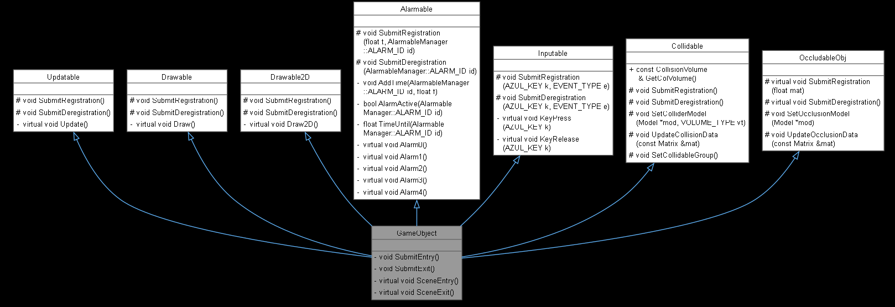
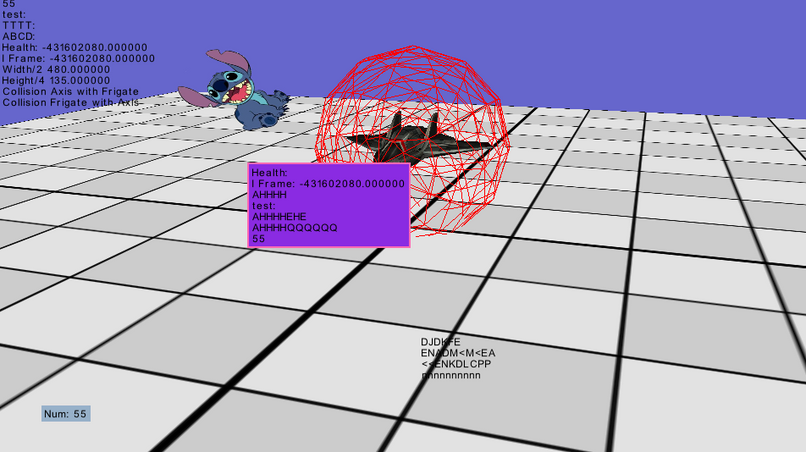
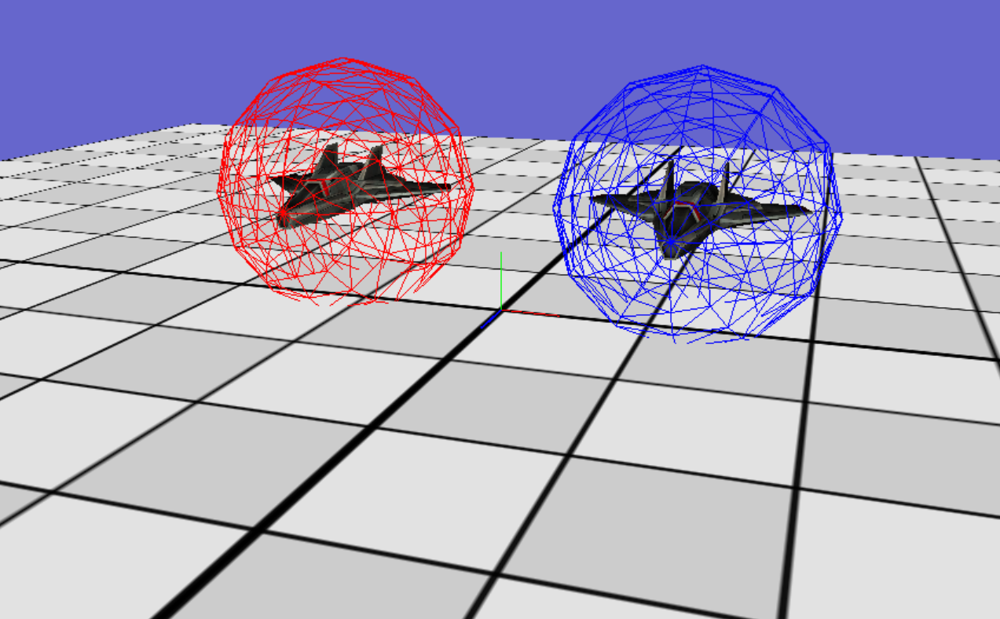

*A custom C++ game engine built around modular engine architecture, reusable gameplay systems, and extensible software design.*

---

# Overview

The **Slippers Engine** is a custom C++ game engine developed to explore engine architecture, gameplay frameworks, and reusable software design. Built on top of a provided graphics framework, the project focused on implementing the systems required to support game development, including object management, scene organization, collision detection, audio, and debugging tools.

Development began with establishing the engine's core architecture. A modular game object framework was created around reusable behaviors such as updating, rendering, input handling, alarms, and collision detection. These systems provided a flexible foundation for gameplay programming while encouraging code reuse and clear separation of responsibilities.

The engine was later expanded with more advanced functionality. The collision system evolved from simple bounding sphere tests to support both axis-aligned and oriented bounding boxes, while terrain support was added to enable larger and more dynamic environments. As part of the project, I also designed and implemented a complete audio framework using **OpenAL**, adding support for 3D positional audio, environmental reverb, and sound occlusion to create a more immersive gameplay experience.

Throughout development, I created a variety of debugging tools to improve development efficiency. These included an on-screen logging system with configurable panels, a free camera, collision visualization tools, and time manipulation features for debugging gameplay behavior. To validate the engine and demonstrate its capabilities, a fully playable tank game was developed alongside the engine, serving as both a testbed for new systems and a practical demonstration of the engine's functionality.

---

<h1 class="section-title">Quick Facts</h1>

| | |
|---|---|
| **Status** | 
  Completed 
 |
| **Team Size** | Solo |
| **Duration** | Jan 2025 - Jun 2025 |
| **Language** | C++ |
| **Version Control** | Perforce |
| **Platform** | Windows |
| **Documentation** | [Doxygen](https://mal3ris.github.io/SlippersEngineDocs/index.html) |

---

## Technical Highlights

Implemented the core systems that form the foundation of the engine while emphasizing modularity, reusability, and maintainable software design.

▶ [Game Object Framework](#game-object-framework)

▶ [Audio Framework](#audio-framework)

▶ [Developer Tools](#developer-tools)

▶ [Challenges & Lessons](#challenges-lessons)

---

<h1 class="section-title">Game Object Framework</h1>

### Highlights

- Component-style behavior through service subscriptions
- Modular update, rendering, collision, input, and timer systems
- Efficient execution using registration-based lists
- Reusable architecture for gameplay object creation

[Documentation](https://mal3ris.github.io/SlippersEngineDocs/group___game_objects.html)

The Game Object Framework forms the foundation of the engine. Every gameplay object inherits from a common `GameObject` base class, which in turn derives from a collection of service classes including **Updatable**, **Drawable**, **Alarmable**, **Collidable**, and **Inputable**. Rather than every object participating in every engine system by default, objects explicitly register for the services they require. This subscription-based approach reduces unnecessary processing while keeping gameplay code modular and easy to extend.

Each service is responsible for a specific aspect of gameplay behavior and maintains its own collection of registered objects. During the engine's update loop, each manager iterates only over the objects that have subscribed to its functionality, allowing systems to remain independent while avoiding large monolithic update functions.

#### Updatable

The **Updatable** service executes once per frame and is responsible for general gameplay logic. Systems such as movement, AI, and object state changes are implemented through this interface, providing a consistent update cycle for gameplay objects.

#### Drawable

Rendering is divided into **Drawable** and **Drawable2D** services. World objects are rendered through the standard drawable pipeline, while UI and other transparent elements are handled separately through the 2D pipeline. Separating these systems ensures that interface elements are rendered after the 3D scene while avoiding transparency ordering issues.

#### Alarmable

The **Alarmable** service provides built-in timer functionality. Every game object has access to five independent timers that can be scheduled to execute after a specified duration. This allows delayed gameplay events to be implemented without manually tracking elapsed time within update functions.

#### Collidable

The collision framework supports multiple bounding volume types, including **Bounding Spheres**, **Axis-Aligned Bounding Boxes (AABB)**, and **Oriented Bounding Boxes (OBB)**.

To improve performance, the engine employs two optimization strategies:

- Every collision test begins with a fast bounding sphere check before evaluating more expensive collision volumes.
- Objects register collision pairs, ensuring they are only tested against relevant object types rather than every collidable object in the scene.

Together, these optimizations significantly reduce the number and cost of collision calculations performed each frame.

#### Inputable

The **Inputable** service uses an event subscription model. Objects register for specific keyboard inputs, indicating whether they should respond to key presses, releases, or both. The input manager dispatches events only to subscribed objects, removing the need for every gameplay object to continuously poll keyboard state each frame.

By separating gameplay behaviors into independent services, the Game Object Framework provides a modular and extensible foundation for the engine. New gameplay objects can be created by inheriting only the functionality they require, reducing coupling between systems while making the engine easier to maintain and expand.

    
    
<em>*Inheritance hierarchy of the Game Object Framework, demonstrating how gameplay objects compose reusable engine services through modular base classes.*</em>

---

<h1 class="section-title">Audio Framework</h1>

### Highlights

- Custom audio framework built with OpenAL
- 3D positional audio and listener management
- Environmental reverb with configurable acoustic spaces
- Material-based sound occlusion integrated with terrain

[Documentation](https://mal3ris.github.io/SlippersEngineDocs/group___sound.html)

[Audio Demo](https://www.youtube.com/@LungeSoftware)

The Audio Framework was designed and implemented entirely by me using **OpenAL**. I chose OpenAL because it provided a lightweight, flexible API while supporting advanced features such as 3D positional audio and environmental effects. The system is built around four primary components: the **Listener**, **Sound Sources**, **Reverb Spaces**, and **Occlusion**. Together, these systems create an immersive audio environment while remaining modular and extensible.

### Listener

The **Listener** represents the player's perspective within the world. Its position and orientation are updated each frame, allowing sounds to be spatialized based on the player's location and viewing direction. This forms the foundation of the engine's 3D audio system and enables other features, such as occlusion and environmental effects, to react naturally as the player moves throughout the scene.

### Sound Sources

The engine supports two types of sound sources:

- **World Space Sources** exist within the game world and respond to distance attenuation, spatial positioning, reverb, and occlusion.
- **Listener Space Sources** remain relative to the listener, making them ideal for interface sounds and other non-spatial audio.

Both source types support playback controls including play, pause, stop, looping, pitch adjustment, and volume control, while sharing a common interface for sound management.

### Reverb Spaces

The engine supports configurable **Reverb Spaces** that simulate different acoustic environments. Reverb volumes can be placed throughout a scene and automatically affect nearby sound sources.

To simplify development, several preset environments are included, including:

- Small Room
- Studio
- Concert Hall
- Cave
- Cathedral

For greater flexibility, custom environments can also be created by configuring properties such as density, diffusion, gain, decay time, and other OpenAL reverb parameters.

### Occlusion

One of the engine's most advanced audio features is its **material-based occlusion system**.

When a sound source is registered as occludable, the engine performs line-of-sight tests between the source and the listener. Objects registered as **Occludable Objects** participate in these tests and define the material through which sound travels.

Each material influences audio differently, with built-in presets such as wood, brick, wool, and dirt affecting the amount of attenuation applied. The system also supports multiple layers of occluding geometry, allowing sound to realistically pass through several walls or obstacles before reaching the listener.

The occlusion framework integrates directly with the terrain system, allowing hills and other landscape features to naturally block and dampen sounds without requiring any additional implementation by gameplay code.

By separating spatialization, environmental effects, and occlusion into independent systems, the Audio Framework remains modular while supporting realistic and highly configurable audio behavior. New sound types, reverb environments, and material definitions can be introduced without modifying the core audio architecture.

---

<h1 class="section-title">Developer Tools</h1>

### Highlights

- On-screen logging and customizable debug panels
- Free camera for scene inspection
- Collision and geometry visualization
- Time manipulation for debugging
- Utility math library for common engine operations

[Documentation](https://mal3ris.github.io/SlippersEngineDocs/group___debug_tools.html)

To improve development efficiency, I built a collection of developer tools that simplified debugging and testing throughout the engine's development. These tools provided real-time insight into engine behavior, reduced the time required to diagnose issues, and made it significantly easier to verify new gameplay systems as they were implemented. The toolkit includes an on-screen logging system, customizable debug panels, a free camera, collision visualization, time controls, and a reusable mathematics utility library.

### Screen Logger

The screen logging system provides real-time feedback directly within the game window. Simple log messages can be displayed in the upper-left corner of the screen, while more advanced **Debug Panels** can be positioned anywhere within the viewport.

Each panel automatically resizes itself to fit its contents and supports independently configurable background and border colors, allowing related debugging information to be grouped together and quickly identified during development.

    
    
<em>*Multiple developer tools operating simultaneously, including collision visualization, the screen logger, and customizable debug panels used to rapidly diagnose and validate engine behavior.*</em>

### Free Camera

The free camera allows developers to freely navigate scenes independent of gameplay. It proved particularly useful when validating collision volumes, inspecting level geometry, and observing gameplay systems from different perspectives.

During development, the free camera was frequently used alongside the collision visualizer to verify that collision calculations behaved correctly in three-dimensional space.

### Collision Visualization

The collision visualizer provides several methods for inspecting engine geometry in real time. It can display individual points, line segments, and complete collision volumes while allowing each element to be assigned a custom color.

This visualization framework was invaluable during the development of the collision system, making it possible to quickly verify collision volumes and identify mathematical errors that would have been difficult to diagnose through code alone.

    
    
<em>*Bounding sphere collision volumes visualized in real time. The engine's debugging tools were used throughout development to verify collision calculations and rapidly identify spatial errors.*</em>

### Time Controls

The engine includes tools for pausing gameplay and advancing execution in a controlled manner. By freezing time, gameplay state can be inspected while stepping through code within the debugger, making it easier to isolate logic errors and validate engine behavior frame by frame.

### Mathematics Utilities

[Documentation](https://mal3ris.github.io/SlippersEngineDocs/group___math_tools.html)

The engine also includes a reusable mathematics utility library containing commonly used helper functions. These utilities simplify development by providing frequently needed operations such as:

- Degree and radian conversion
- Screen-space to world-space coordinate conversion
- Fast square root approximation
- Random floating-point number generation
- Value clamping

Centralizing these functions reduced duplicated code throughout the engine while providing consistent implementations for commonly used mathematical operations.

Together, these developer tools significantly improved the speed and reliability of development. Rather than treating debugging as an afterthought, the engine provides dedicated tooling that makes diagnosing problems, validating gameplay systems, and testing new features considerably more efficient.

---

<h1 class="section-title">Challenges & Lessons</h1>

Building the Slippers Engine was my first large-scale software project, spanning approximately 25 weeks of development. More than any previous project, it taught me the importance of designing reusable building blocks rather than focusing solely on individual features. Many of the systems implemented early in development, such as the Game Object Framework and collision architecture, became the foundation upon which every subsequent feature was built. This reinforced the value of investing time in clean architecture before rapidly expanding a project.

The project's size also highlighted the importance of documentation. As the engine continued to grow, I made a conscious effort to thoroughly document classes, systems, and their intended usage. This not only made it easier to revisit older code after weeks of development but also reinforced the importance of writing software that is understandable to both others and my future self.

One of the most valuable aspects of the project was the opportunity to independently design and architect a major engine system. Choosing to implement an audio framework with OpenAL required researching an unfamiliar library, designing an extensible architecture, and integrating it with existing systems such as collision detection and terrain. It was my first experience taking a system from initial concept through design, implementation, debugging, and refinement.

Finally, developing the accompanying tank game demonstrated the importance of validating engine features through real gameplay. Every new system was immediately exercised in a practical environment, exposing edge cases and integration issues that would have been difficult to discover through isolated testing alone. This experience reinforced the idea that an engine is only as strong as the applications built with it.
